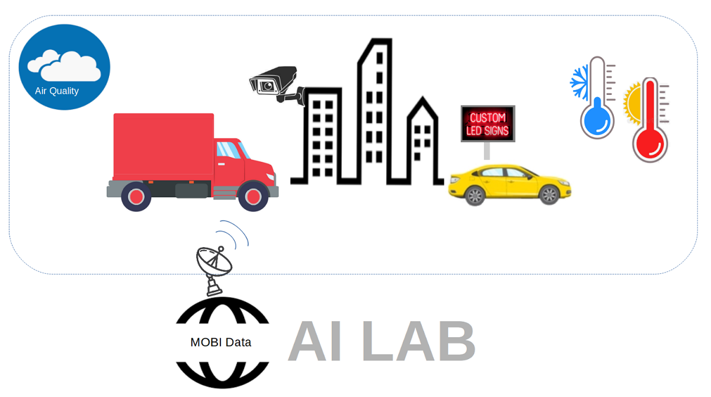

This AI Lab has three IoT Devices, one autonomous vehicle, a "public radio", and a data mart.  It was designed to teach youth about robotics and artificial intelligence, but adults like it too.

<h2><a href="https://github.com/NelsonPython/AstroPiQuake">AstroPiQuake</a></h2>

AstroPiQuake is an environment sensor that can also detect earthquakes.  It is easy to build with snap together parts.
Try out the <a href="https://trinket.io/python/9c2e984979">AstroPiQuake emulator</a>.  Move the temperature slider to see Smiley's face change colors from cool blue to mellow yellow to red hot. Follow these <a href="https://github.com/NelsonPython/AstroPiQuake">instructions</a> to build it

<h2><a href="https://github.com/NelsonPython/Enviro">Enviro</a></h2>
Enviro is an environment sensor that can also detect sky color to help forecast weather.  To build it, you must solder and snap together parts.  Follow these <a href="https://github.com/NelsonPython/Enviro">instructions</a>

<h2><a href="https://github.com/NelsonPython/Air_MacClean">Air MacClean</a></h2>
Air MacClean is a CO2 and TVOC sensor.  To build it, you must solder and attach wires.  Follow these 
<a href="https://github.com/NelsonPython/Air_MacClean">instructions</a>.

<h2><a href="https://github.com/NelsonPython/Bumblebee_AV">Bumblebee AV</a></h2>
Bumblebee AV is a simple autonomous vehicle.  There are many ways to build the vehicle.  These 
<a href="https://github.com/NelsonPython/Bumblebee_AV">instructions</a> recommend LegosTM and robot parts.  The motor controller must be soldered and wires, motors, and wheels must be attached.  I do not recommend using a three-wheel robot with a coaster wheel because it is difficult to control when turning left or right.  

<h2><a href="https://github.com/NelsonPython/AI_Lab/blob/master/PublicRadio.md">Public Radio</a></h2>
Public radio can run on an edge computing device such as a <a href="https://github.com/NelsonPython/AI_Lab/blob/master/PublicRadio_RaspberryPi.md">Raspberry Pi 4</a>, a computer, or an <a href="https://github.com/NelsonPython/AI_Lab/blob/master/PublicRadio.md">Oracle VirtualBox</a>. 

